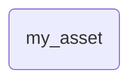
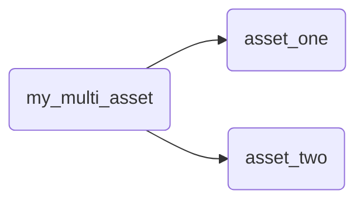
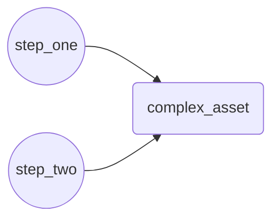

An asset in Dagster represents a piece of data that is produced by a computation, and includes metadata such as dependencies, tags, and descriptions. The most common way to create a data asset in Dagster is by annotating a function with the `@asset` decorator. The function it wraps computes the contents of the asset, such as a database table or file.

Dagster supports several ways of creating assets, but this guide will focus on using Python decorators to define data assets.

  
Prerequisites

To follow the steps in this guide, you'll need:

- To have Dagster installed. Refer to the [Installation](/tutorial/installation) guide for more information.
- Knowledge of Python, including decorators and functions.

Dagster has four types of asset decorators:

| Decorator                      | Description                                                                                    |
|--------------------------------|------------------------------------------------------------------------------------------------|
| [`@asset`](#single-asset)      | Defines a single asset.                                                                        |
| [`@multi_asset`](#multi-asset) | Outputs multiple assets from a single operation.                                               |
| [`@graph_asset`](#graph-asset) | Outputs a single asset from multiple operations without making each operation itself an asset. |
| `@graph_multi_asset`           | Outputs multiple assets from multiple operations. TODO: Add a link to the example.             |

For most use cases, you'll use the `@asset` decorator to define a single asset. This is the recommended approach when you are starting with Dagster because it's the simplest to understand and use. With the `@asset` decorator, you define both a single asset and a single function that computes the asset.

## Create an asset \{#single-asset}

The simplest way to define a data asset in Dagster is by using the `@asset` decorator.

This decorator does two things: it creates an Asset Definition, which describes the asset metadata such as its key, dependencies, groups, and tags; and it creates an Op, which is the computation that creates the asset.

<CodeExample filePath="guides/data-assets/data-assets/asset_decorator.py" language="python" title="Using @dg.asset decorator" />

In this example, three assets are defined: `daily_sales`, `weekly_sales`, and `weekly_sales_report`. Dagster automatically tracks their dependencies and handles their execution within the pipeline.

## Advanced usage

### Create multiple assets from a single operation \{#multi-asset}

If a single operation creates multiple assets, you can use the `@multi_asset` decorator. This allows you to output multiple assets while maintaining a single processing function, which could be useful for:

- Making a single call to an API that updates multiple tables
- Using the same in-memory object to compute multiple assets

In this example, `my_multi_asset` produces two assets: `asset_one` and `asset_two`. Each is derived from the same function, which makes it easier to handle related data transformations together:

<CodeExample filePath="guides/data-assets/data-assets/multi_asset_decorator.py" language="python" title="Using @dg.multi_asset decorator" />

### Defining multiple operations that create a single asset \{#graph-asset}

If you need to break a single asset into multiple operations, for example, to save state or make it easier to retry a step without recomputing all previous steps, you can use the `@graph_asset` decorator. This approach encapsulates a series of operations and exposes them as a single asset, allowing you to model complex pipelines while only exposing the final output.

<CodeExample filePath="guides/data-assets/data-assets/graph_asset_decorator.py" language="python" title="Using @dg.graph_asset decorator" />

In this example, `complex_asset` is an asset that's the result of two operations: `step_one` and `step_two`. These steps are combined into a single asset, abstracting away the intermediate representations.

This example could be expressed as:

## Next steps

- Learn to create [dependencies between assets](/guides/asset-dependencies)
- Enrich Dagster's built-in data catalog with [asset metadata](/guides/metadata)
- Learn to use a [factory pattern](/guides/asset-factories) to create multiple, similar assets
